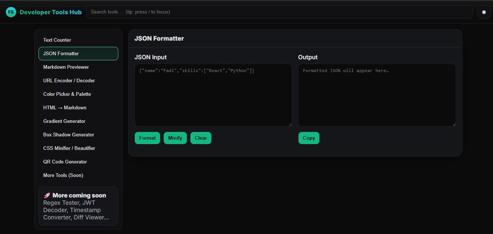
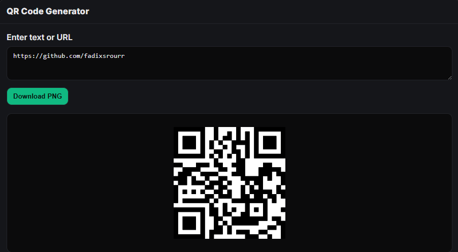

# Developer Tools Hub 🛠️

A modern web utility suite by **Fadi Srour** — JSON formatter, Markdown preview, HTML → Markdown, URL encoder/decoder, Color palette, Gradient & Box-shadow generators, CSS minifier/beautifier, and a QR code generator with PNG download.

## ✨ Features
- 10+ tools for developers & designers
- Sleek dark/light UI with Framer Motion animations
- Keyboard shortcuts: `/` focuses search
- Shareable URLs per tool: `?tool=qr`
- LocalStorage persistence + copy toasts

## 🧩 Tools
- JSON Formatter / Minifier  
- Markdown Previewer  
- HTML → Markdown (Turndown)
- URL Encoder / Decoder
- Color Picker & Palette (saved locally)
- Gradient Generator
- Box Shadow Generator
- CSS Minifier / Beautifier
- QR Code Generator (live preview + **Download PNG**)

## 🖥️ Screenshots
> Put images in `public/screenshots/` and update paths below.



## 🚀 Demo
Live: **https://development-toolshub.netlify.app**

## 🛠 Tech
React 18, Vite, Framer Motion, Turndown, React QR Code

## ⚙️ Local Setup
```bash
npm install
npm run dev
# build
npm run build
npm run preview
